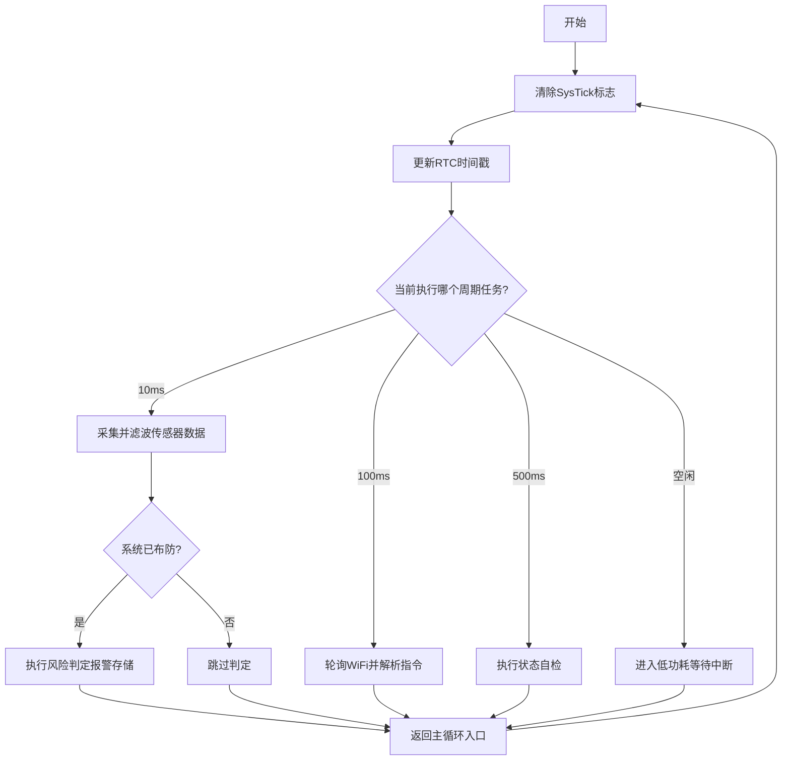

```mermaid
graph TD
    start[开始] --> tick[清除SysTick标志]
    tick --> rtc[更新RTC时间戳]
    rtc --> task{当前执行哪个周期任务?}
    task -->|10ms| sensor[采集并滤波传感器数据]
    sensor --> arm{系统已布防?}
    arm -->|是| judge[执行风险判定报警存储]
    arm -->|否| skip[跳过判定]
    judge --> loop
    skip --> loop
    task -->|100ms| poll[轮询WiFi并解析指令]
    poll --> loop
    task -->|500ms| check[执行状态自检]
    check --> loop
    task -->|空闲| sleep[进入低功耗等待中断]
    sleep --> loop
    loop[返回主循环入口] --> tick
```