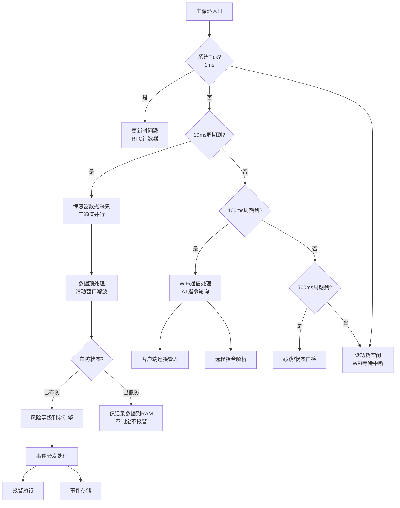

```mermaid
graph TD
    A[主循环入口] --> B{系统Tick?<br/>1ms}
    B -->|是| C[更新时间戳<br/>RTC计数器]
    B -->|否| D{10ms周期到?}
    D -->|是| E[传感器数据采集<br/>三通道并行]
    E --> F[数据预处理<br/>滑动窗口滤波]
    F --> G{布防状态?}
    G -->|已布防| H[风险等级判定引擎]
    H --> I[事件分发处理]
    I --> J[报警执行]
    I --> K[事件存储]
    G -->|已撤防| L[仅记录数据到RAM<br/>不判定不报警]
    D -->|否| M{100ms周期到?}
    M -->|是| N[WiFi通信处理<br/>AT指令轮询]
    N --> O[客户端连接管理]
    N --> P[远程指令解析]
    M -->|否| Q{500ms周期到?}
    Q -->|是| R[心跳/状态自检]
    Q -->|否| S[低功耗空闲<br/>WFI等待中断]
    B --> S
```